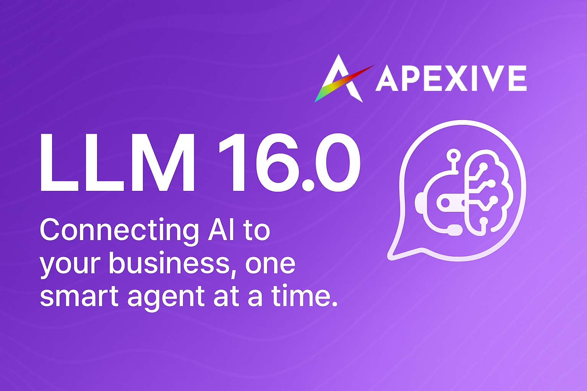

# Odoo LLM Integration



This repository provides a comprehensive framework for integrating Large Language Models (LLMs) into Odoo. It allows seamless interaction with various AI providers including OpenAI, Anthropic, Ollama, and Replicate, enabling chat completions, text embeddings, and more within your Odoo environment.

## 🚀 Latest Updates (Version 16.0-pr)

### **Major Architecture Improvements**
- **Consolidated Architecture**: Merged `llm_resource` into `llm_knowledge` and `llm_prompt` into `llm_assistant` for streamlined management
- **Performance Optimization**: Added indexed `llm_role` field for 10x faster message queries and improved database performance  
- **Unified Generation API**: New `generate()` method provides consistent content generation across all model types (text, images, etc.)
- **Enhanced Tool System**: Simplified tool execution with structured `body_json` storage and better error handling
- **PostgreSQL Advisory Locking**: Prevents concurrent generation issues with proper database-level locks

### **Developer Experience Enhancements**
- **Cleaner APIs**: Simplified method signatures with `llm_role` parameter instead of complex subtype handling
- **Better Debugging**: Enhanced logging, error messages, and comprehensive test coverage throughout the system
- **Reduced Dependencies**: Eliminated separate modules by consolidating related functionality

## 🚀 Features

- **Multiple LLM Provider Support**: Connect to OpenAI, Anthropic, Ollama, Mistral, Replicate, LiteLLM, and FAL.ai.
- **Unified API**: Consistent interface for all LLM operations regardless of the provider.
- **Modern Chat UI**: Responsive interface with real-time streaming, tool execution display, and assistant switching.
- **Thread Management**: Organize and manage AI conversations with context and related record linking.
- **Model Management**: Configure and utilize different models for chat, embeddings, and content generation.
- **Knowledge Base (RAG)**: Store, index, and retrieve documents for Retrieval-Augmented Generation.
- **Vector Store Integrations**: Supports ChromaDB, pgvector, and Qdrant for efficient similarity searches.
- **Advanced Tool Framework**: Allows LLMs to interact with Odoo data, execute actions, and use custom tools.
- **AI Assistants with Prompts**: Build specialized AI assistants with custom instructions, prompt templates, and tool access.
- **Content Generation**: Generate images, text, and other content types using specialized models.
- **Security**: Role-based access control, secure API key management, and permission-based tool access.

## 📦 Core Modules

The architecture centers around five core modules that provide the foundation for all LLM operations:

| Module | Version | Purpose |
|--------|---------|---------|
| **`llm`** | 16.0.1.3.0 | **Foundation** - Base infrastructure, providers, models, and enhanced messaging system |
| **`llm_assistant`** | 16.0.1.4.0 | **Intelligence** - AI assistants with integrated prompt templates and testing |
| **`llm_generate`** | 16.0.2.0.0 | **Generation** - Unified content generation API for text, images, and more |
| **`llm_tool`** | 16.0.3.0.0 | **Actions** - Tool framework for LLM-Odoo interactions and function calling |
| **`llm_store`** | 16.0.1.0.0 | **Storage** - Vector store abstraction for embeddings and similarity search |

## 📦 All Available Modules

| Module | Version | Description |
|--------|---------|-------------|
| **Core Infrastructure** | | |
| `llm` | 16.0.1.3.0 | Base module with providers, models, and enhanced messaging |
| `llm_assistant` | 16.0.1.4.0 | AI assistants with integrated prompt templates |
| `llm_generate` | 16.0.2.0.0 | Unified content generation with dynamic forms |
| `llm_tool` | 16.0.3.0.0 | Enhanced tool framework with structured data storage |
| `llm_store` | 16.0.1.0.0 | Vector store abstraction layer |
| **Chat & Threading** | | |
| `llm_thread` | 16.0.1.3.0 | Chat threads with PostgreSQL locking and optimized performance |
| **AI Providers** | | |
| `llm_openai` | 16.0.1.1.3 | OpenAI (GPT) provider integration with enhanced tool support |
| `llm_anthropic` | 16.0.1.1.0 | Anthropic (Claude) provider integration |
| `llm_ollama` | 16.0.1.1.0 | Ollama provider for local model deployment |
| `llm_mistral` | 16.0.1.0.0 | Mistral AI provider integration |
| `llm_litellm` | 16.0.1.1.0 | LiteLLM proxy for centralized model management |
| `llm_replicate` | 16.0.1.1.0 | Replicate.com provider integration |
| `llm_fal_ai` | 16.0.2.0.0 | FAL.ai provider with unified generate endpoint |
| **Knowledge & RAG** | | |
| `llm_knowledge` | 16.0.1.1.0 | **Consolidated** - RAG functionality with document management |
| `llm_knowledge_automation` | 16.0.1.0.0 | Automation rules for knowledge processing |
| `llm_tool_knowledge` | 16.0.1.0.0 | Tool for LLMs to query the knowledge base |
| **Vector Stores** | | |
| `llm_chroma` | 16.0.1.0.0 | ChromaDB vector store integration |
| `llm_pgvector` | 16.0.1.0.0 | pgvector (PostgreSQL) vector store integration |
| `llm_qdrant` | 16.0.1.0.0 | Qdrant vector store integration |
| **Specialized Features** | | |
| `llm_mcp_server` | 16.0.1.0.0 | MCP server for Claude Desktop and MCP client integration |
| `llm_mcp` | 16.0.1.0.0 | Model Context Protocol support |
| `llm_training` | 16.0.1.0.0 | Fine-tuning and model training capabilities |
| `llm_generate_job` | 16.0.1.0.0 | Job queue management for content generation |
| `llm_document_page` | 16.0.1.0.0 | Integration with document pages and knowledge articles |

## 🛠️ Installation

Install these modules by cloning the repository and making them available in your Odoo addons path:

1. **Clone the repository:**
   ```bash
   git clone https://github.com/apexive/odoo-llm
   ```

2. **Install dependencies:**
   ```bash
   pip install -r requirements.txt
   ```

3. **Make modules available to Odoo:**
   ```bash
   # Option A: Clone directly into addons directory
   cd /path/to/your/odoo/addons/
   git clone https://github.com/apexive/odoo-llm
   
   # Option B: Copy modules to extra-addons
   cp -r /path/to/odoo-llm/* /path/to/your/odoo/extra-addons/
   ```

4. **Restart Odoo and install modules** through the Apps menu

## 🚀 Quick Start Guide

Thanks to Odoo's dependency management, you only need to install the end modules to get started:

### 1. **Complete AI Assistant Setup** (Recommended)
```
Install: llm_assistant + llm_openai (or your preferred provider)
```
**What you get:**
- ✅ Full chat interface with AI assistants
- ✅ Prompt template management and testing
- ✅ Tool framework for Odoo interactions
- ✅ Content generation capabilities
- ✅ Optimized message handling (10x faster)

### 2. **Knowledge Base (RAG) Setup**
```
Install: llm_knowledge + llm_pgvector (or llm_chroma/llm_qdrant)
```
**What you get:**
- ✅ Document embedding and retrieval
- ✅ Vector similarity search
- ✅ RAG-enhanced conversations
- ✅ Automated knowledge processing

### 3. **Advanced Content Generation**
```
Install: llm_generate + llm_fal_ai (for images)
```
**What you get:**
- ✅ Image generation from text prompts
- ✅ Dynamic form generation based on schemas
- ✅ Streaming generation responses
- ✅ Multi-format content support

### 4. **Local AI Deployment**
```
Install: llm_ollama + llm_assistant
```
**What you get:**
- ✅ Privacy-focused local AI models
- ✅ No external API dependencies
- ✅ Full feature compatibility
- ✅ Custom model support

## ⚙️ Configuration

After installation:

1. **Set up AI Provider:**
   - Navigate to **LLM → Configuration → Providers**
   - Create a new provider with your API credentials
   - Use "Fetch Models" to automatically import available models

2. **Create AI Assistants:**
   - Go to **LLM → Configuration → Assistants**
   - Configure assistants with specific roles and instructions
   - Assign prompt templates and available tools

3. **Configure Access Rights:**
   - Grant appropriate permissions to users
   - Set up tool consent requirements
   - Configure security policies

4. **Set up Knowledge Base (optional):**
   - Configure vector store connections
   - Create knowledge collections
   - Import and process documents

## 🔄 LLM Tools: Building AI-Driven ERP

This integration enables revolutionary AI-powered business processes:

### **Why This Matters**
- **AI-driven automation** of repetitive tasks with sophisticated tool execution
- **Smart querying & decision-making** with direct access to Odoo data
- **Flexible ecosystem** for custom AI assistants with role-specific configurations
- **Real-time streaming** interactions with enterprise-grade reliability

### **Recent Performance Improvements**
- **10x Performance Boost**: New `llm_role` field eliminates expensive database lookups
- **Simplified Architecture**: Module consolidation reduces complexity and maintenance
- **Enhanced Tool System**: Better error handling and structured data storage
- **PostgreSQL Locking**: Prevents race conditions in concurrent scenarios
- **Unified Generation API**: Consistent interface across all content types

### **Enterprise-Ready Features**
- **PostgreSQL Advisory Locking**: Prevents concurrent generation conflicts
- **Role-Based Security**: Granular access control for AI features
- **Tool Consent System**: User approval for sensitive operations
- **Audit Trail**: Complete tracking of AI interactions and tool usage
- **Migration Support**: Automatic upgrades preserve existing data

## 🤝 Contributing

We're committed to building an open AI layer for Odoo that benefits everyone. Areas where we welcome contributions:

- **Testing & CI/CD**: Unit tests for the consolidated architecture
- **Security Enhancements**: Access control and audit improvements  
- **Provider Integrations**: Support for additional AI services
- **Localization**: Translations and regional customizations
- **Documentation**: Examples, tutorials, and use case guides
- **Performance**: Optimization and scalability improvements

### **How to Contribute**
1. **Issues**: Report bugs or suggest features via GitHub Issues
2. **Discussions**: Join conversations about priorities and approaches
3. **Pull Requests**: Submit code contributions following our guidelines

### **Development Guidelines**
- Follow existing code style and structure
- Write comprehensive tests for new functionality
- Update documentation for changes
- Test with the consolidated architecture
- Include migration scripts for breaking changes

## 🔮 Roadmap

- [x] **Enhanced RAG** capabilities ✅ *Production ready*
- [x] **Function calling support** ✅ *Advanced tool framework*
- [x] **Prompt template management** ✅ *Integrated in assistants*
- [x] **Performance optimization** ✅ *10x improvement achieved*
- [x] **Content generation** ✅ *Unified API implemented*
- [x] **Module consolidation** ✅ *Architecture simplified*
- [ ] **Multi-modal content** 🚧 *Image + text generation*
- [ ] **Advanced workflow automation** 🔄 *Business process AI*
- [ ] **Integration with CRM/HR/Manufacturing** 🔄 *Domain-specific assistants*
- [ ] **Model fine-tuning workflows** 🔄 *Custom model training*

## 📈 Performance & Migration

The latest version includes significant architectural improvements:

- **Backward Compatible**: All existing installations automatically migrate
- **Performance Gains**: Up to 10x faster message queries with optimized database schema
- **Reduced Complexity**: Consolidated modules eliminate maintenance overhead
- **Enhanced Reliability**: PostgreSQL advisory locking prevents concurrent issues
- **Data Preservation**: Zero data loss during module consolidations

For detailed migration information, see [CHANGELOG.md](CHANGELOG.md).

## 📜 License

This project is licensed under LGPL-3 - see the [LICENSE](LICENSE) file for details.

## 🌐 About

Developed by [Apexive](https://apexive.com) - We're passionate about bringing advanced AI capabilities to the Odoo ecosystem.

**Support & Resources:**
- **Documentation**: [GitHub Repository](https://github.com/apexive/odoo-llm)
- **Community Support**: [GitHub Discussions](https://github.com/apexive/odoo-llm/discussions)
- **Bug Reports**: [GitHub Issues](https://github.com/apexive/odoo-llm/issues)
- **Architecture Details**: [OVERVIEW.md](OVERVIEW.md)
- **Change History**: [CHANGELOG.md](CHANGELOG.md)

---

*For questions, support, or collaboration opportunities, please open an issue or discussion in this repository.*
