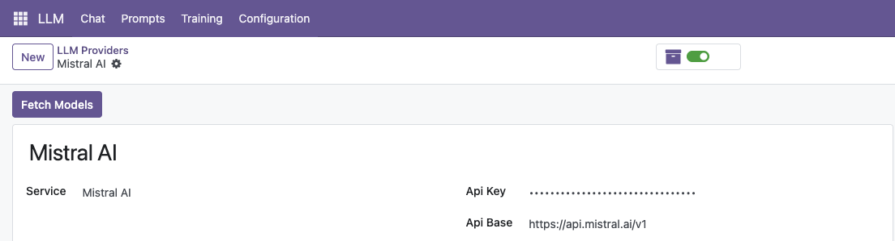
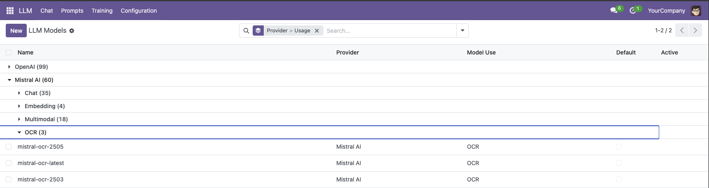
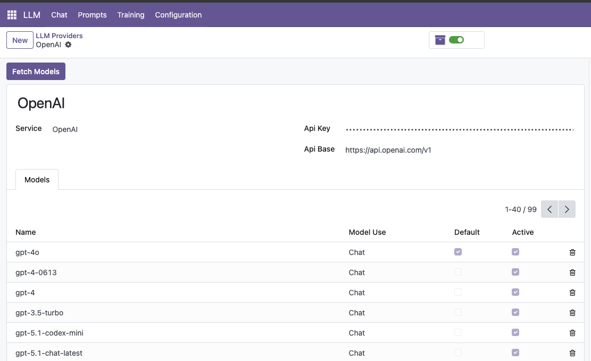
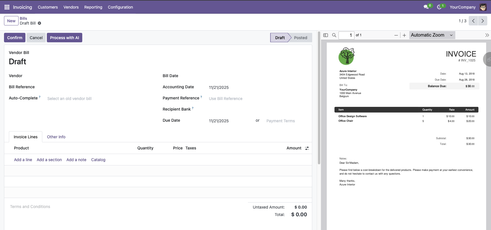
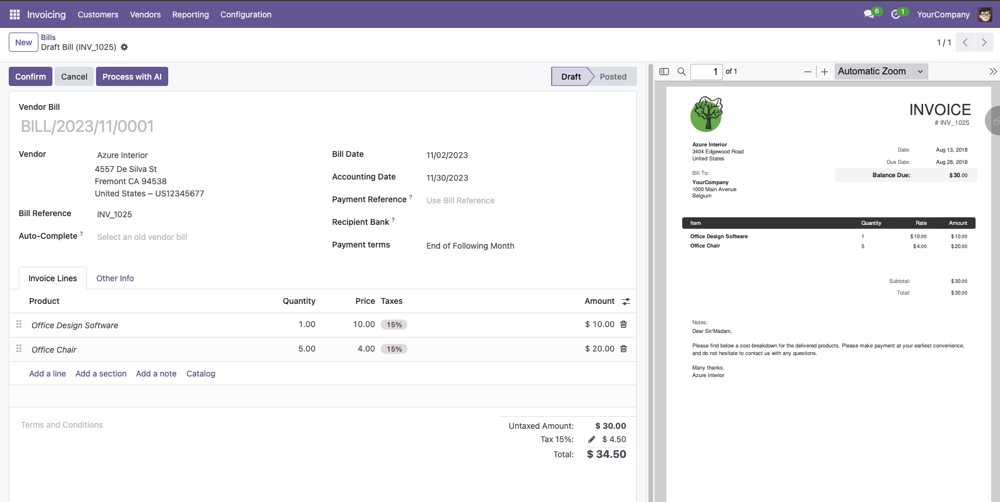

# Account Invoice Import LLM

AI-powered invoice data extraction with OCR for Odoo 16 - integrates with OCA's account_invoice_import.

## Features

- 📄 **Automatic OCR Extraction**: Extract invoice data from PDFs and images using Mistral OCR
- 🤖 **One-Shot AI Processing**: Single LLM call extracts all invoice data (vendor, dates, amounts, line items)
- 🔗 **OCA Integration**: Seamlessly extends `account_invoice_import` wizard as fallback parser
- ⚡ **EDI Decoder**: Automatically processes attachments via Odoo's EDI decoder chain
- 🔘 **Manual Trigger**: "Process with AI" button for on-demand extraction
- 📊 **Smart Data Mapping**: Converts LLM output to OCA's Invoice Pivot Format

## Installation

1. Install dependencies:

   - `account_invoice_import` (OCA - invoice import wizard)
   - `llm_assistant` (LLM infrastructure)
   - `llm_mistral` (Mistral provider for OCR)

2. Install the module:

   ```bash
   odoo-bin -d your_database -i account_invoice_import_llm
   ```

3. Configure Mistral provider in **Settings → LLM → Providers**

## Screenshots

### 1. Configure Mistral Provider
Add your Mistral API key and sync models. Mistral OCR is essential for parsing invoice attachments.



### 2. OCR Models Available
After syncing, the `mistral-ocr-latest` model is automatically available for parsing invoice attachments.



### 3. LLM Provider for Data Extraction
Configure any LLM provider (ChatGPT, Gemini, Claude, etc.) for intelligent data extraction from OCR text.



### 4. Click "Process with AI" on Draft Invoice
Open any draft vendor bill and click the "Process with AI" button to manually trigger extraction.



### 5. Invoice Automatically Filled
After AI processing, the form reloads with extracted data: vendor, date, amounts, line items.



## Usage

### Three Ways to Extract Invoice Data

#### 1. **Automatic Processing** (Recommended)

Simply upload a PDF or image to an invoice:

1. Create a new vendor bill (Accounting → Vendors → Bills)
2. Attach an invoice PDF or image
3. **Invoice is automatically processed!**
   - EDI decoder triggers on attachment upload
   - OCR extracts text from document
   - LLM extracts structured data
   - Invoice fields are populated

#### 2. **Manual Processing**

For invoices created before module installation:

1. Open a draft invoice with an attached PDF/image
2. Click **"Process with AI"** button
3. **Form reloads with extracted data**

#### 3. **OCA Invoice Import Wizard**

When using OCA's invoice import wizard:

1. Go to **Accounting → Vendors → Import Vendor Bill**
2. Upload PDF invoice
3. If no embedded XML found, **LLM extraction is used as fallback**
4. Invoice is created with extracted data

### What Gets Extracted

The LLM extracts and populates:

- ✅ Vendor name and VAT number
- ✅ Invoice number and reference
- ✅ Invoice date and due date
- ✅ Currency
- ✅ Subtotal, tax, and total amounts
- ✅ Line items with descriptions, quantities, unit prices, and tax rates

## Module Architecture

### OCA Invoice Import Integration

Follows the standard OCA pattern for extending `account_invoice_import`:

```
account_invoice_import_llm/
├── __manifest__.py                   # Dependencies and metadata
├── __init__.py                       # Pre-init hook for module rename
├── models/
│   ├── account_invoice_import_ocr.py # AbstractModel: OCR + LLM extraction
│   └── account_move.py               # "Process with AI" button
├── wizard/
│   └── account_invoice_import.py     # OCA fallback_parse_pdf_invoice()
├── data/
│   ├── llm_prompt_invoice_data.xml   # One-shot extraction prompt
│   └── llm_assistant_data.xml        # Assistant configuration
└── views/
    └── account_move_views.xml        # Button view extension
```

### Processing Flows

#### Flow 1: Automatic Decoder (Odoo Native)

```
1. User uploads PDF to invoice
   ↓
2. account.move.create_document_from_attachment_decoders()
   ↓
3. _llm_ocr_decoder() checks if PDF is suitable
   ↓
4. Creates draft invoice with journal
   ↓
5. _extract_invoice_data_from_attachment()
   - Creates LLM thread with OCR context
   - Runs one-shot extraction prompt
   - Returns extracted data as JSON
   ↓
6. _populate_invoice_from_data()
   - Populates vendor, dates, amounts
   - Creates invoice lines
   - Processes UBL XML if present
   ↓
7. Decoder returns invoice
   ↓
8. Journal links attachment to invoice
```

#### Flow 2: Manual Trigger

```
1. User clicks "Process with AI" button
   ↓
2. action_process_with_llm()
   - Validates invoice is draft
   - Finds PDF/image attachment
   ↓
3. _extract_invoice_data_from_attachment()
   - Same extraction as automatic flow
   ↓
4. _populate_invoice_from_data()
   - Populates invoice fields
   ↓
5. Returns action to reload form view
   ↓
6. User sees populated invoice data
```

#### Flow 3: OCA Wizard Fallback

```
1. User uploads PDF via OCA wizard
   ↓
2. Wizard calls parse_pdf_invoice()
   ↓
3. Checks for embedded XML (UBL, Factur-X)
   - If found: Uses XML parser
   - If not found: Calls fallback_parse_pdf_invoice()
   ↓
4. Our fallback_parse_pdf_invoice()
   - Creates temp invoice for context
   - Extracts data via LLM
   - Converts to OCA's Invoice Pivot Format
   ↓
5. Wizard creates invoice from pivot format
   ↓
6. Wizard automatically links attachment
```

### Key Components

#### 1. OCR Extraction AbstractModel

**File**: `models/account_invoice_import_ocr.py`

Central extraction logic shared by wizard and manual button:

- Runs Mistral OCR on file bytes
- Renders prompt with OCR text context
- Calls LLM for structured extraction
- Converts to OCA Invoice Pivot Format

#### 2. One-Shot Extraction Prompt

**File**: `data/llm_prompt_invoice_data.xml`

Structured prompt that instructs LLM to extract:

```json
{
  "vendorName": "Supplier Inc.",
  "vat": "BE0123456789",
  "invoiceNumber": "INV-2024-001",
  "invoiceDate": "2024-01-15",
  "dueDate": "2024-02-14",
  "currency": "EUR",
  "subtotalAmount": 100.0,
  "taxAmount": 21.0,
  "totalAmount": 121.0,
  "lines": [
    {
      "description": "Product",
      "quantity": 1.0,
      "unitPrice": 100.0,
      "taxPercent": 21.0
    }
  ]
}
```

#### 3. OCA Wizard Integration

**File**: `wizard/account_invoice_import.py`

Extends `fallback_parse_pdf_invoice()` to delegate to OCR AbstractModel.

The AbstractModel converts LLM's camelCase JSON to OCA's snake_case Invoice Pivot Format:

```python
{
    'type': 'in_invoice',
    'partner': {'vat': 'BE0123456789', 'name': 'Supplier Inc.'},
    'currency': {'iso': 'EUR'},
    'date': '2024-01-15',
    'date_due': '2024-02-14',
    'amount_untaxed': 100.0,
    'amount_total': 121.0,
    'invoice_number': 'INV-2024-001',
    'lines': [
        {
            'name': 'Product description',
            'qty': 1.0,
            'price_unit': 100.0,
            'taxes': [{'amount_type': 'percent', 'amount': 21.0}],
        }
    ],
    'chatter_msg': [],
}
```

## Technical Details

### EDI Decoder Registration

The module registers `_llm_ocr_decoder` in Odoo's EDI decoder chain:

```python
@api.model
def _get_create_document_from_attachment_decoders(self):
    decoders = super()._get_create_document_from_attachment_decoders()
    return decoders + [self._llm_ocr_decoder]
```

Decoder priority ensures XML parsers run first, LLM-OCR as fallback.

### Error Handling Strategy

- **Top-level handlers**: Decoder, manual action, OCA wizard
- **Intermediate methods**: Raise exceptions directly (no hiding)
- **User-friendly errors**: Clear messages about what failed and why
- **Logging**: Detailed error info in server logs for debugging

### Pre-Init Hook

**File**: `__init__.py`

Handles module rename from `llm_assistant_account_invoice` → `account_invoice_import_llm`:

1. Updates `ir_model_data` records from old module name
2. Adopts orphaned records (prevents FK violations)
3. Prevents duplicate key errors on installation

## Configuration

### Invoice Extraction Assistant

**Location**: Settings → LLM → Assistants → Invoice Data Extraction (Automatic)

The assistant is pre-configured with:

- **Prompt**: One-shot extraction template with detailed instructions
- **Model**: Any LLM (GPT-4, Claude, Gemini, etc.)
- **OCR Tool**: Mistral OCR for text extraction
- **Dynamic Context**: OCR text injected automatically

### Customization

To customize extraction behavior:

1. Go to **Settings → LLM → Prompts → Invoice Data Extraction (One-Shot)**
2. Edit the `instructions` argument to add/remove fields
3. Update the JSON structure in `default_values`
4. Modify `_convert_llm_data_to_pivot()` if adding new fields

## Troubleshooting

### Issue: "No PDF or image attachment found"

**Solution**: Attach a PDF or image file to the invoice before clicking "Process with AI"

### Issue: "Failed to extract data"

**Possible causes**:
- Poor quality scan/image
- Non-standard invoice format
- OCR couldn't extract text

**Solution**: Check server logs for detailed error. Try with a higher quality scan.

### Issue: "Mistral provider not configured"

**Solution**: Install `llm_mistral` module and configure Mistral provider with API key

### Issue: Duplicate records after module rename

**Solution**: The pre-init hook should handle this automatically. If issues persist, check `ir_model_data` for orphaned records.

## Credits

### Authors

- Apexive Solutions LLC

### Contributors

- Module development and LLM integration
- OCA invoice import pattern implementation

### Maintainers

This module is maintained by Apexive Solutions LLC.

## License

LGPL-3
